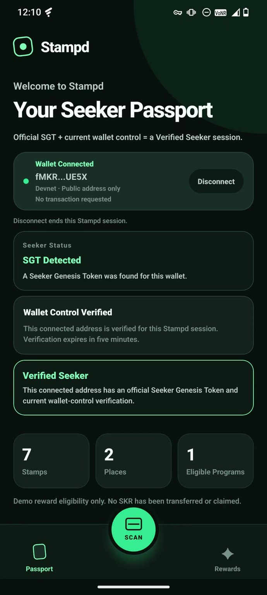
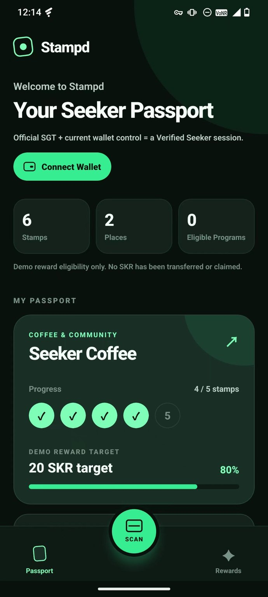
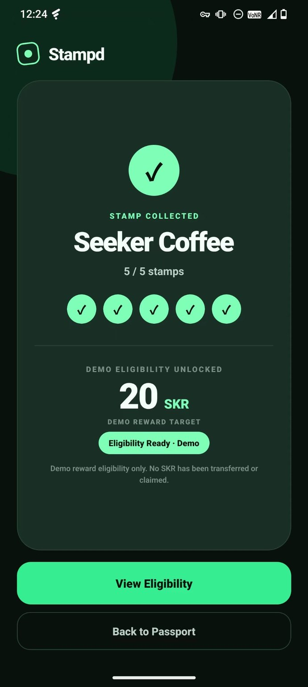

# Stampd

### A Seeker-native loyalty passport.

**Verify with SGT. Build loyalty with Stampd. Reward with SKR.**

Stampd turns real-world merchant visits into a Seeker-native loyalty experience built for Solana Mobile.

A user connects a compatible mobile wallet, Stampd checks for an official **Seeker Genesis Token (SGT)**, and the user proves current wallet control through a one-time **Sign-In With Solana (SIWS)** message.

When both checks are valid for the same address and session, Stampd derives a short-lived **Verified Seeker** session.

From there, users can visit participating merchants, scan loyalty QR codes, collect stamps, complete programs, and unlock clearly labeled **SKR-based demo reward eligibility**.

> The current hackathon build does not transfer or claim SKR. SKR amounts shown in the app are explicitly labeled **DEMO REWARD TARGETS**.

## Product flow

```text
Connect Wallet
      ↓
Official SGT Detected
      ↓
Verify Wallet Control with SIWS
      ↓
Verified Seeker
      ↓
Visit Merchant
      ↓
Scan QR
      ↓
Collect Stamp
      ↓
4/5 → 5/5
      ↓
Demo Reward Eligibility
      ↓
20 SKR Demo Reward Target

```

## See Stampd in action

<table>
<tr>
<td width="33%" align="center">

<br />
<b>1. Verify the Seeker</b>
<br />
Official SGT + current wallet control.
</td>

<td width="33%" align="center">

<br />
<b>2. Build loyalty</b>
<br />
A merchant program one visit away from completion.
</td>

<td width="33%" align="center">

<br />
<b>3. Unlock eligibility</b>
<br />
5/5 stamps and an SKR-denominated demo reward target.
</td>
</tr>
</table>

## Why Stampd?

Traditional loyalty programs are usually isolated inside individual merchants.

Stampd explores a Seeker-native loyalty model built around three layers:

**SGT → Identity**

**Stampd → Loyalty**

**SKR → Reward Layer**

The app combines Mobile Wallet Adapter, official SGT holder recognition, SIWS wallet-control proof, camera-based merchant QR scanning, and a clear loyalty progression into one Android-first experience.

## Why users come back

Stampd is designed around repeat merchant visits rather than a one-time wallet interaction.

```text
Visit
  ↓
Collect Stamp
  ↓
Progress is saved
  ↓
Return to Merchant
  ↓
Complete the Program
  ↓
Unlock Reward Eligibility
```

For the validated Seeker Coffee flow, the final demo step starts at **4/5 stamps**.

One additional approved QR scan moves the program to:

**5/5 → DEMO ELIGIBILITY UNLOCKED**

This creates a simple repeat-visit loop for users while giving merchants a loyalty experience designed specifically around Seeker.

## Built for Solana Mobile

- ✅ Solana Mobile Wallet Adapter
- ✅ Official SGT mainnet read-only verification
- ✅ One-time SIWS wallet-control verification
- ✅ Address- and session-bound Verified Seeker derivation
- ✅ Five-minute wallet-control proof expiry
- ✅ Camera-based merchant QR scanning
- ✅ Strict QR payload validation
- ✅ Duplicate stamp rejection
- ✅ Local loyalty persistence
- ✅ Seed Vault real-device validation
- ✅ 133 / 133 tests PASS
- ✅ Physical Seeker smoke test PASS

Stampd is non-custodial and does not request seed phrases or private keys.

The current build does not implement transaction signing, SKR transfers, token approvals, redemption, or claiming.

## Demo video

**Demo video:** Coming soon

Validated judge flow:

**Seed Vault → SGT Detected → Wallet Control Verified → Verified Seeker → Scan → Stamp Collected → 5/5 → Demo Eligibility Unlocked**

---

## Final Submission Candidate

- Source checkpoint: `a62c9dc8341218c00304f0f755a7511db6f13570`
- Git tag: `submission-candidate-final-smoke-pass`
- EAS Build ID: `76badfba-da31-45ee-9c58-8724e7c1682c`
- APK SHA-256: `1B7192CB3F54E22DD1DF981CA86C96B17690C792498F7F4251446349BA2A219C`
- Validation: **133/133 PASS**
- Physical Seeker smoke: **PASS**

The final physical Seeker test passed Seed Vault wallet authorization, real official SGT detection, SIWS Wallet Control verification, Verified Seeker derivation, and the exact demo QR scan. Seeker Coffee reached `5/5` and displayed **DEMO ELIGIBILITY UNLOCKED**. The displayed `20 SKR` is only a **DEMO REWARD TARGET**: no SKR was transferred or claimed, and Stampd contains no transaction or fund-moving capability.

The annotated tag `submission-candidate-final-smoke-pass` points to the exact source commit used by the tested final APK. Any later documentation-only commit does not change that tested artifact or its provenance. This checkpoint is a hackathon submission candidate, not a production-readiness declaration.

## Problem

Mobile loyalty programs are fragmented, easy to duplicate, and rarely portable. Merchants also need a way to recognize a real Seeker holder without taking custody of wallet secrets or asking the user to move funds.

## Solution

Stampd combines two independent facts for the connected address:

1. Read-only detection of an official SGT.
2. A fresh, five-minute proof that the user controls the current wallet session.

Only when both facts are valid for the same address and session does Stampd display **Verified Seeker**. The user can then scan the strict demo QR payload, store a local stamp, and see local demo reward eligibility.

## Why Seeker

Seeker supplies the mobile wallet environment and the official SGT used for holder recognition. Stampd turns those primitives into a judge-friendly loyalty journey while keeping the wallet in control and keeping all current loyalty state explicitly local.

## Core user flow

1. Open Stampd and enter the passport.
2. Connect a compatible Mobile Wallet Adapter wallet on `solana:devnet`.
3. Stampd checks the connected address for an official SGT through a read-only mainnet verifier.
4. The user explicitly signs a one-time SIWS identity message.
5. `SGT Detected` + `Wallet Control Verified` derives `Verified Seeker` for the current session.
6. The user scans the Seeker Coffee demo QR code.
7. The final stamp is saved locally and demo reward eligibility becomes ready.

## What is real

- Solana Mobile Wallet Adapter authorization and public-address retrieval.
- Public Stampd identity at `https://identity.stampdpass.com` with Android Digital Asset Links.
- Read-only official SGT verification on Solana mainnet.
- One-time SIWS challenge issuance, wallet message signing, server verification, replay protection, and five-minute expiry.
- Address- and session-bound Verified Seeker derivation.
- Camera permission handling, strict QR parsing, duplicate rejection, and local stamp persistence.
- Real-device positive validation with an official SGT-holding Seed Vault wallet/account.

## What is local/demo

- Merchant and loyalty-program data.
- Stamp history and the Seeker Coffee final demo stamp.
- Summary statistics, derived from the visible local merchant programs.
- SKR numbers, which are **demo reward targets**, not balances or owned assets.
- Reward eligibility UI.

## What is not implemented

- Transaction signing or submission.
- SOL, SPL-token, or SKR transfers.
- SKR minting, claiming, redemption, or token approvals.
- An onchain stamp database or merchant backend.
- A production reward economy.

## Official SGT verification

The mobile app sends the connected public address to the dedicated SGT verifier. The verifier performs a read-only mainnet check against the official Token-2022 identifiers and returns a bounded result. This is not a transaction and does not require the wallet to sign anything.

## Wallet Control and SIWS

Wallet Control requests a one-time challenge from `https://auth.stampdpass.com`, asks the already connected wallet to sign the SIWS identity message, and sends the result to the verifier. A verified proof expires after five minutes, is bound to the exact address and session epoch, and is never persisted by the app.

## Verified Seeker derivation

`Verified Seeker = official SGT detected for the current address + unexpired SIWS proof for the same address and session.`

The status is pure derived state. Disconnect, same-address reconnect, expiry, address changes, or app restart remove it fail-closed.

## QR loyalty demo

The scanner accepts only one versioned JSON shape with exact keys and values. It does not save photos, record audio, or upload images or camera frames. The accepted Seeker Coffee stamp is persisted with AsyncStorage and duplicate scans do not add another stamp.

## Local persistence model

Only the Stage 4 demo stamp is persistent. Wallet sessions, authorization credentials, SIWS proof, and Verified Seeker state remain memory-only. Local app data can be cleared from Android system settings before a demo; there is no production reset control.

## Demo reward eligibility

Reward screens show local progress and explicitly qualified SKR demo targets. **No real SKR claim or transfer is implemented.** Completing five local Seeker Coffee stamps changes only the local demo eligibility state.

## Architecture overview

```text
Android app
├─ Mobile Wallet Adapter → compatible wallet
├─ identity.stampdpass.com → identity page, icon, Digital Asset Links
├─ sgt.stampdpass.com → read-only SGT verifier → Helius/Solana mainnet
├─ auth.stampdpass.com → SIWS challenge + verification
└─ Camera + AsyncStorage → strict QR parsing + local loyalty state
```

See [docs/ARCHITECTURE.md](docs/ARCHITECTURE.md) for boundaries and data flow. The three Worker projects currently live beside, not inside, this versioned mobile repository; packaging them for a submission repository is intentionally deferred.

## Mobile technology stack

- Expo 57 and React Native 0.86
- TypeScript and Expo Router
- Solana Mobile Wallet Adapter 2.3.0
- `@solana/web3.js` through the React Native compatibility package
- Expo Camera with Android audio recording disabled
- AsyncStorage for the single local demo stamp
- EAS Build for Android APKs

## Worker architecture

- **Identity Worker:** serves the public root, Stampd icon, and exact-JSON Digital Asset Links response.
- **SGT verifier Worker:** performs bounded, rate-limited, read-only mainnet verification with its server-side provider credential.
- **Auth verifier Worker:** issues one-time SIWS challenges, stores replay state in a Durable Object, and verifies signed identity messages.

No Worker grants rewards, moves funds, or receives wallet private material.

## Security model

Stampd is non-custodial. It never accesses seed phrases or private keys. Wallet authorization stays on Solana devnet. Official SGT status is checked read-only on Solana mainnet. Wallet Control uses a one-time SIWS identity message, not a transaction, and expires after five minutes. Stamps and reward eligibility are local demo state. This build does not transfer or claim SKR.

More detail is in [docs/SECURITY.md](docs/SECURITY.md).

## Network model

| Boundary                | Network/scope                        | Behavior                                                   |
| ----------------------- | ------------------------------------ | ---------------------------------------------------------- |
| Wallet authorization    | Solana devnet                        | Authorize and read the public address                      |
| SGT verification        | Solana mainnet, read-only            | Check official SGT ownership for that address              |
| Wallet Control          | SIWS identity scope `solana:mainnet` | Sign a one-time identity message; no transaction           |
| Stamps and eligibility  | Local device                         | AsyncStorage demo state and derived UI                     |
| Transactions and claims | Absent                               | No signing, submission, transfers, approvals, or SKR claim |

## Run locally

Prerequisites are Node.js LTS and an existing compatible Android development client or physical-device setup. Mobile Wallet Adapter native modules do not work in Expo Go.

```bash
npm ci
npm run check
npm run test:qr
npm run doctor
npm run dev
```

Connect the installed development client to the Metro URL shown by Expo. Do not put private keys, seed phrases, Expo tokens, provider keys, or wallet credentials in this repository.

## EAS and Android builds

- Android package: `com.stampd.app`
- Development profile: `development` (custom development client APK)
- Standalone internal profile: `identity-preview` (bundled JavaScript, no Metro required)

The command for a future standalone internal APK is:

```bash
npx eas-cli@latest build --platform android --profile identity-preview
```

Do not run a new build merely to follow this README; review and test source changes first.

## Validated APKs

### Final Submission Candidate APK

- Source commit: `a62c9dc8341218c00304f0f755a7511db6f13570`
- Git tag: `submission-candidate-final-smoke-pass`
- EAS Build ID: `76badfba-da31-45ee-9c58-8724e7c1682c`
- APK SHA-256: `1B7192CB3F54E22DD1DF981CA86C96B17690C792498F7F4251446349BA2A219C`
- Package: `com.stampd.app`
- Validation: `133/133` tests passed
- Physical Seeker smoke: passed on the final Submission Candidate

This is the final tested hackathon artifact. It is not described as production-ready.

### Historical Stage 5B.4 internal release-like APK

- EAS Build ID: `6c175360-4cb3-4425-9d43-fce13999d3a0`
- APK SHA-256: `1F26304D41DFF0AE173874C1D767EAACB466FEC0C777C5DA7F2FC8F6836B76A2`
- Package: `com.stampd.app`
- Validation: historical Stage 5B.4 checkpoint, `122/122` feature tests passed

### Polished physical-test APK

- EAS Build ID: `ad076376-9872-455b-b6c5-6441f8e699d2`
- APK SHA-256: `A0396BA43455BA1C041925699174D46C5CF2658D01E2CF7D747D73F9703128E4`
- Package: `com.stampd.app`
- Mode: internal, release-like, bundled JavaScript, non-debuggable, no Metro requirement

This polished physical-test APK contains Demo Readiness Batch 1 and Batch 1.1. It passed the pre-install artifact audit and the polished physical demo validation. It is an internal submission-candidate precursor, not a production-ready release.

## Testing evidence

The historical stable checkpoint passed **122/122 feature tests**: Stage 5B.4 (20), Stage 5B.3 (80), Stage 5A (9), and Stage 4 (13), plus TypeScript, ESLint, Prettier, Expo Doctor, and the MWA sensitive-log verifier.

The final Submission Candidate source tree passed **133/133 tests** before the final APK build: the 122 existing feature tests plus 11 Demo Truthfulness tests. The resulting final APK is identified above by its EAS Build ID and SHA-256. Current commands are:

```bash
npm run check
npm run test:qr
node --disable-warning=MODULE_TYPELESS_PACKAGE_JSON --experimental-strip-types --test tests/demoTruthfulness.test.mjs
git diff --check
```

## Real-device validation

The final Submission Candidate APK passed the complete judge flow on a physical Seeker. The device's Seed Vault wallet/account passed wallet authorization, real official SGT detection, SIWS, Wallet Control Verified, and Verified Seeker. The exact demo QR produced Stamp Collected, moved Seeker Coffee to `5/5`, displayed Demo Eligibility Unlocked, and retained the explicit statement that `20 SKR` is only a demo reward target and that no SKR was transferred or claimed. Testing stopped on Stamp Success. No transaction, transfer, approval, claim, or fund movement occurred.

The earlier polished internal APK also passed its physical demo validation from the clean state of `6 Stamps`, `2 Places`, `0 Eligible Programs`, and Seeker Coffee at `4/5`. It remains precursor evidence and is not the final submission artifact.

Solflare separately passed wallet authorization, SIWS, the no-SGT negative path, and fail-closed behavior. Solflare was not the real-SGT positive wallet. Phantom remains an open identity-interoperability blocker.

The QR flow made no wallet or transaction call and introduced no Claim or Redeem action. Leaving Passport for Scan replaces and unmounts the Passport route, so its page-local wallet/SIWS state is discarded fail-closed. The disconnected UI seen after returning is not a security failure and is not presented as a production feature. Full wallet addresses and raw signatures were not captured.

## Three-minute demo

Use Seed Vault for the validated real-SGT positive path. Prepare Seeker Coffee at 4/5 with camera permission already granted, then demonstrate Connect → SGT Detected → Wallet Control Verified → Verified Seeker → Scan → Stamp Collected → Demo Eligibility Unlocked. Stop the primary live demo on Stamp Success. The exact preflight, stop conditions, and fallback policy are in [docs/DEMO.md](docs/DEMO.md).

## Demo QR

Display this exact compact JSON on a second device or printed QR code:

```text
{"v":1,"type":"stampd_demo_stamp","merchantId":"seeker-coffee","stampId":"seeker-coffee-demo-5"}
```

Do not scan it during camera-permission preparation, and do not substitute an unreviewed payload.

## Known limitations

- Stamp and reward data are local demo state, not an onchain or synchronized merchant ledger.
- Real SKR claiming, transferring, redemption, and approvals do not exist.
- The SGT and auth checks require network access; transient failures remain fail-closed.
- A Solflare SIWS cancellation may appear as generic `Unable to Verify Wallet Control` when the wallet returns no primitive cancellation code.
- Phantom has shown an unresolved identity-verification warning in some tests despite consistent package, certificate, App Link, DAL, and caller-chain evidence. Never authorize while that warning is visible.

## Live-demo wallet recommendation

Use the device's **Seed Vault** wallet/account with the real official SGT account preselected. It is the physically validated positive path. Solflare is validated for authorization, SIWS, and the no-SGT negative path only. Do not switch wallets mid-demo, expose sensitive association data, use Phantom as a delay workaround, or authorize through any identity warning.

## Screenshots and video

Planned screenshot locations and privacy rules are documented in [docs/screenshots/README.md](docs/screenshots/README.md). No screenshots or video are fabricated in this repository. Add a reviewed demo-video link here only after recording and privacy review.

## More documentation

- [Demo runbook](docs/DEMO.md)
- [Architecture](docs/ARCHITECTURE.md)
- [Security](docs/SECURITY.md)
- [Feature boundaries](src/features/README.md)
