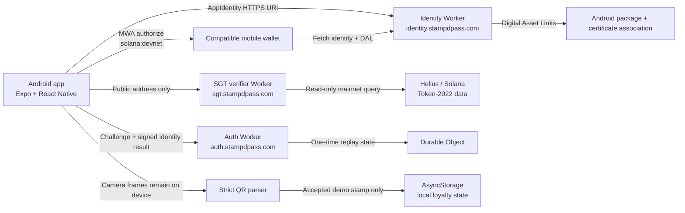

# Stampd architecture

## System view

The identity, SGT-verifier, and auth-verifier Worker projects currently live beside the versioned mobile repository. This batch documents them but does not move or package them.

## Trust and state boundaries

| Capability           | Boundary                                              | Stored state                                        | Side effects                                                                   |
| -------------------- | ----------------------------------------------------- | --------------------------------------------------- | ------------------------------------------------------------------------------ |
| Wallet authorization | **DEVNET** through Mobile Wallet Adapter              | Session credentials in memory only                  | Reads public address; no transaction                                           |
| App identity         | HTTPS identity origin + Android DAL                   | Public identity assets                              | Establishes domain/package/certificate association                             |
| SGT verification     | **MAINNET READ-ONLY** through the SGT Worker          | No mobile SGT override                              | Queries official Token-2022 identity; no token mutation                        |
| Wallet Control       | **IDENTITY MESSAGE** with `solana:mainnet` SIWS scope | One-time server challenge; proof in app memory only | Message signature only; no transaction or fee                                  |
| Verified Seeker      | Pure mobile derivation                                | Not persisted                                       | True only for matching address, session epoch, SGT result, and unexpired proof |
| Loyalty              | **LOCAL** camera + AsyncStorage                       | One demo stamp                                      | No upload, wallet call, or chain write                                         |
| Rewards              | **LOCAL DEMO** presentation                           | Derived eligibility                                 | No claim, transfer, mint, approval, or redemption                              |
| Transactions         | **ABSENT**                                            | None                                                | No signing or submission API in product flow                                   |

## Mobile layers

- `app/` contains Expo Router screens and ordinary presentation navigation.
- `src/components/` contains reusable visual components.
- `src/features/wallet/` owns MWA authorization, memory-only session state, SIWS orchestration, and safe failure handling.
- `src/features/seeker/` owns bounded SGT request/response handling and address-bound state.
- `src/features/verification/` derives Verified Seeker without storing a boolean.
- `src/features/stamps/` validates the exact QR schema and persists only the accepted demo stamp.
- `src/data/mockLoyalty.ts` defines the two local merchant programs and derives displayed summary totals.

## Identity chain

Stampd sends this MWA identity:

- Name: `Stampd`
- URI: `https://identity.stampdpass.com`
- Icon: `stampd-icon.png`

The Android package is `com.stampd.app`. The identity origin serves its public page, icon, and `/.well-known/assetlinks.json`; Android App Links use the same HTTPS host. No private signing material is present in this repository or needed by the app at runtime.

## Verified Seeker derivation

The UI may display Verified Seeker only when all inputs agree:

1. A connected address exists for the current session epoch.
2. The latest accepted SGT result is `detected` and is bound to that exact address.
3. SIWS state is `verified`.
4. The proof address equals the current address.
5. The proof session epoch equals the current session epoch.
6. The proof has not reached its strict five-minute expiry.

Any missing, stale, mismatched, expired, disconnected, restarted, or unable state derives false.

## Worker responsibilities

- **Identity Worker:** static identity resources and exact DAL MIME behavior. It does not handle wallet sessions.
- **SGT verifier Worker:** validates an input public address, rate-limits requests, queries provider/mainnet Token-2022 data, and returns a narrow status. Its provider credential remains server-side.
- **Auth verifier Worker:** issues a one-time SIWS challenge, stores replay/expiry state in a Durable Object, verifies the result, and returns a short-lived proof response.

The mobile app never receives Worker secrets. Workers never receive seed phrases, private keys, or transaction authority.
